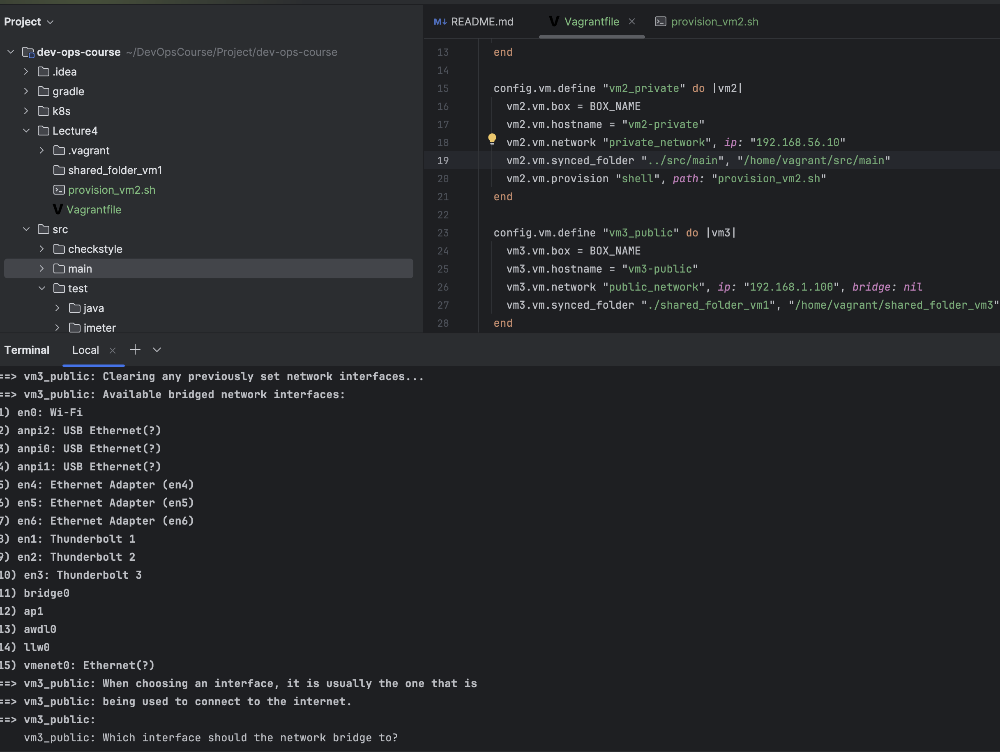
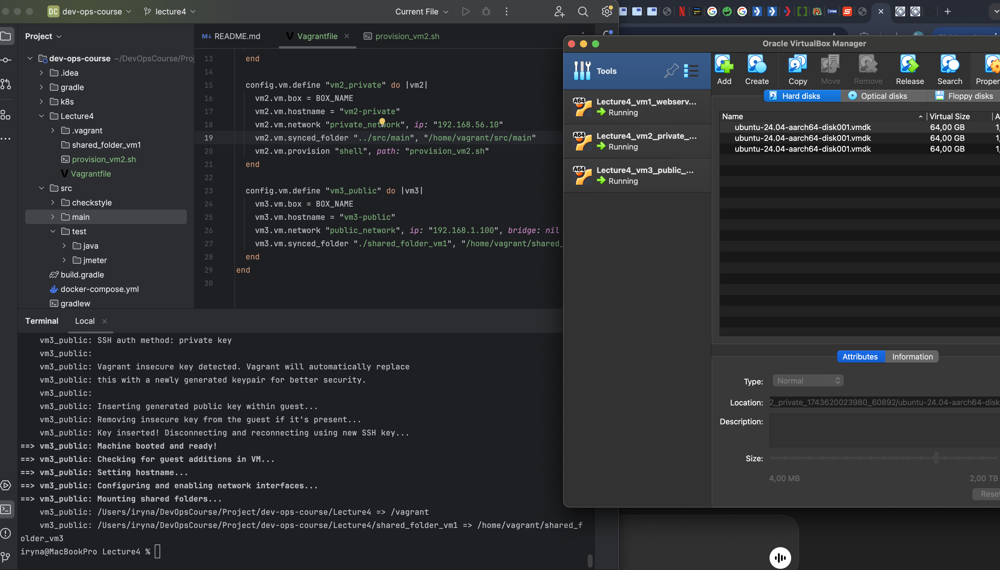
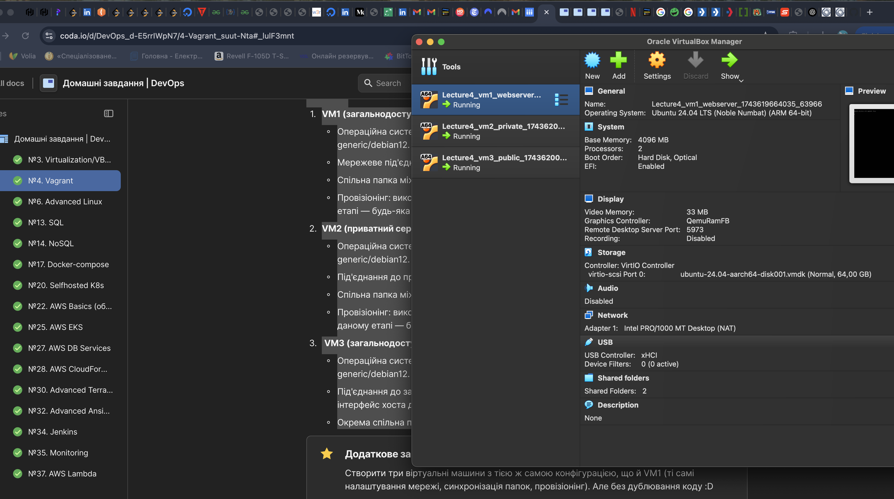
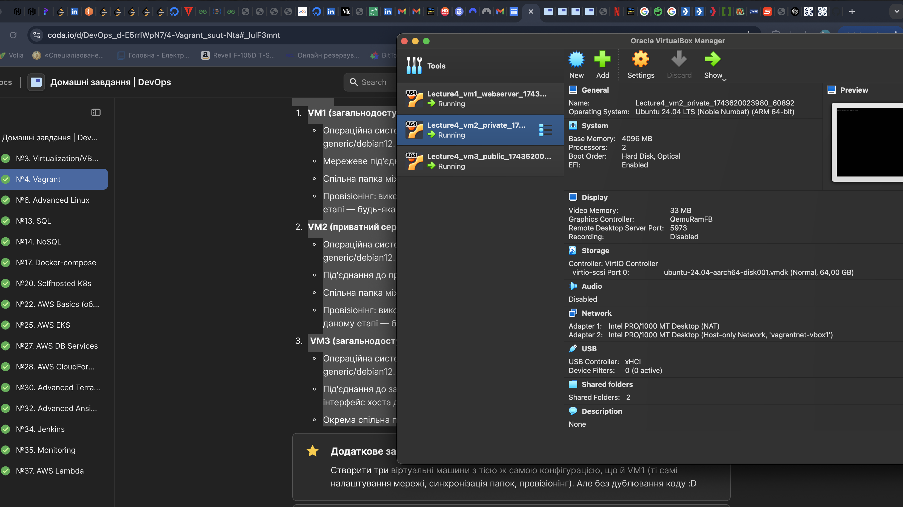
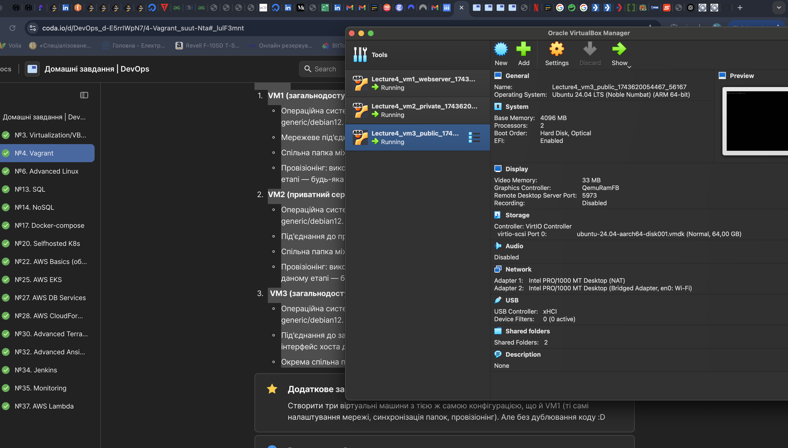
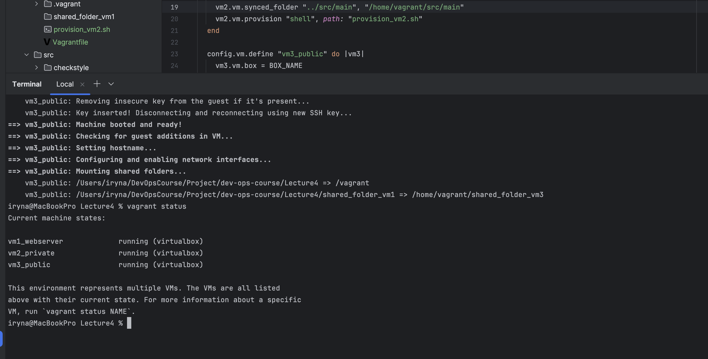

# DevOps Vagrant Lab – Lecture 4

## ✅ VM1: Web Server

- Встановлена ОС: Ubuntu 24.04
- Використовується NAT + forwarded port (8080 → 80)
- Встановлено nginx
- Синхронізована папка: `./shared_folder_vm1`

### 🖼 Скриншот vargrant up:

---

## ✅ VM2: Private Server

- Статичний приватний IP: `192.168.56.10`
- Provisioning з Bash-скрипта
- Синхронізована папка: `../src/main`

### 🖼 Скриншот vargrantfile:

---

## ✅ VirtualBox started

- Статичний IP: `192.168.1.100`
- nginx відображає custom `index.html`
- Синхронізована папка: `./shared_folder_vm1`

### 🖼 Скриншот started:

### 🖼 Скриншот started VM1:

### 🖼 Скриншот started VM2:

### 🖼 Скриншот started VM3:

### 🖼 Скриншот running:

---